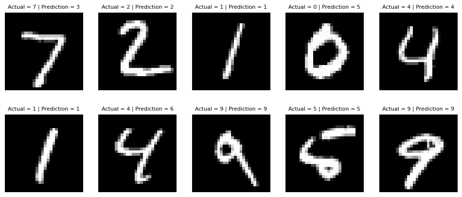

A deep dive into backpropagation to make sure I have it all figured out.

Inspired by Andrej's Karpathy micrograd and George Hotz' tinygrad

Is it computationally expensive? Definitely so. Is it practical to use? Heck no. Should it ever be used in real scenarios? That's a big no. Does it even work? So far :-). 

mnist.ipynb shows that a NN can be fitted to MNIST, although with high computation time (17 training minutes) and low accuracy (46 %) due to python being the computation backend. This is not impressive, but this shows that the module works as expected.

