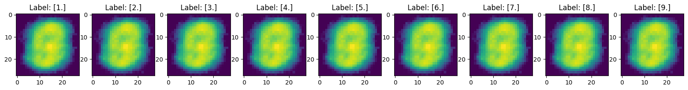
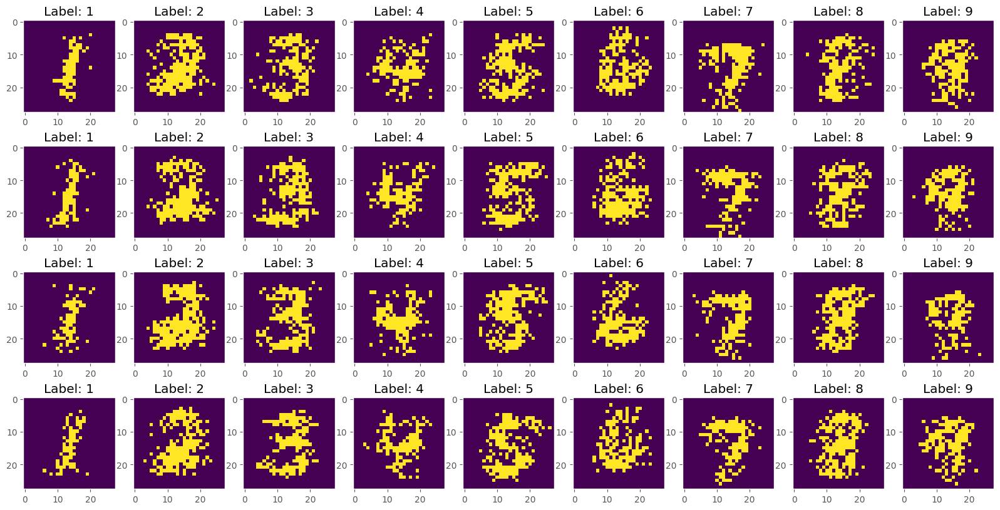

### MNIST Synthetic Data
Here I have experimented with two different approaches to creating synthetic data from scratch.
* simple_NN: A simple neural network with batch_norm, dropout, 3 hidden layers and relu activation.
* Probability_model: A simple probability model that makes a new picture from a label. The overall shape of the label can be seen, but the picture is of very bad quality.

##### GAN:

##### Simple NN:

##### Probability model:
