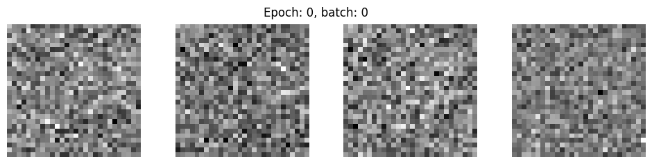
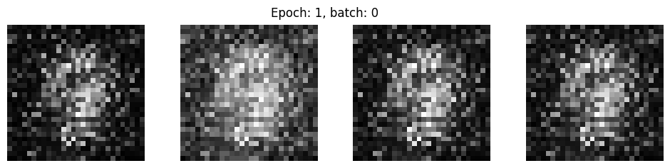
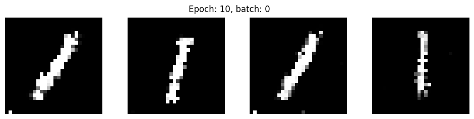
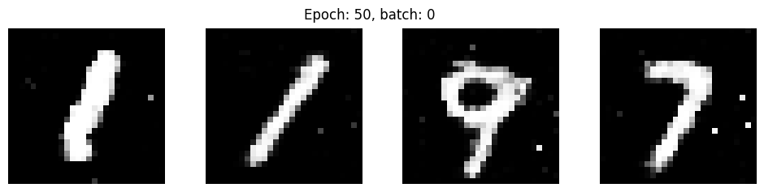
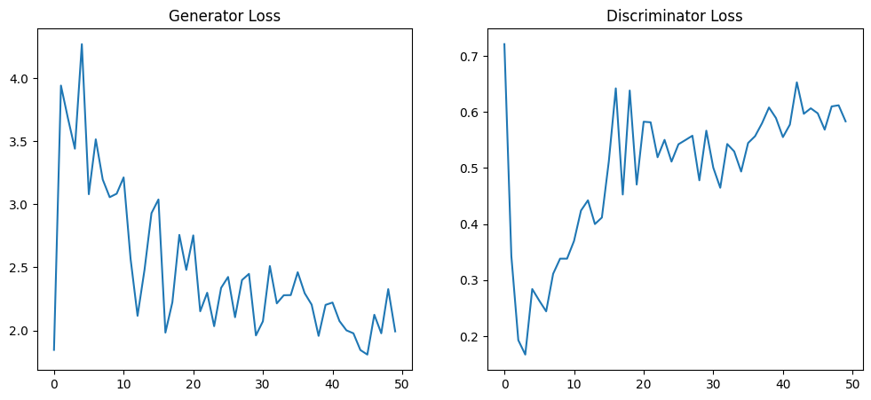

## MNIST Synthetic Data
Here I have experimented with two different approaches to creating synthetic data from scratch.
* simple_NN: A simple neural network with batch_norm, dropout, 3 hidden layers and relu activation.
* Probability_model: A simple probability model that makes a new picture from a label. The overall shape of the label can be seen, but the picture is of very bad quality.
* GAN: A simple generator and discriminator architecture as proposed in Goodfellow et al. (2014). This GAN does not used convolutional layers, which could increase the performance. Maybe I will make another model with conv layers later :-).

### GAN:
##### After 0 epochs

##### After 1 epochs

##### After 10 epochs

##### After 50 epochs

##### Loss over time

### Simple NN:

### Probability model:

