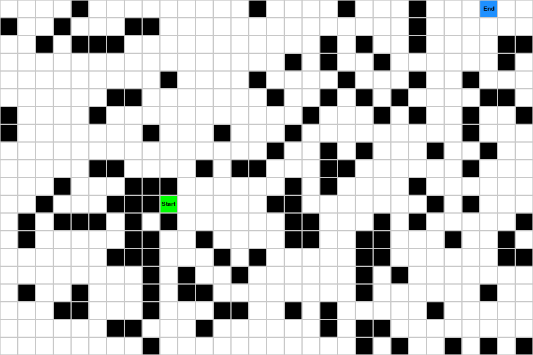
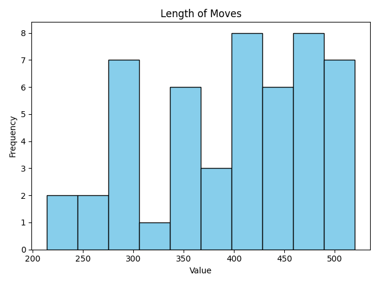
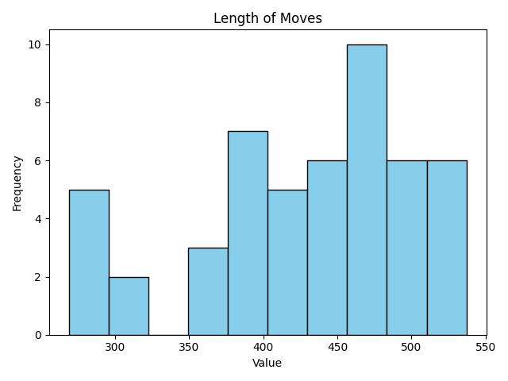
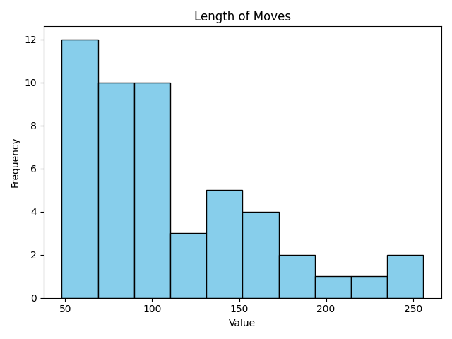
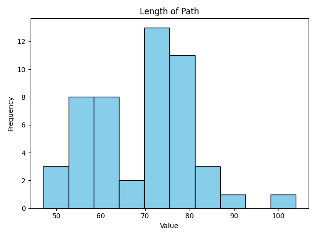
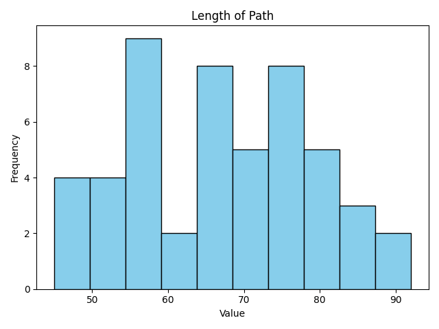
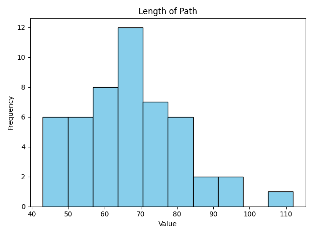

Throught it would be nice to visualize some pathfinding algorithms and study how they work, so I made this.

To run the simulation run:
```
python3 simulation.py
```

This will all 4 solvers. You need to close the app to move on the next.

## Baseline Simulation
- The simulation will always produce solveable simulations.
- All obstacles, start and end position is known from the start
- Each tile has a 40% probability of being an obstacle
- Map is currently 25 x 40 tiles. The starting position is always in the first 10 rows, and the end position in the last 10 rows.
 
### Algorithms used:
- BaselineSolvers: Both a random and a circular solver. CircleBaselineSolver is basically the theory behind [Dijkstra’s algorithm](https://www.graphable.ai/blog/pathfinding-algorithms/), but since there is no difference in the length between nodes, this becomes a simple circular solver more like [Breadth First Search](https://www.geeksforgeeks.org/breadth-first-search-or-bfs-for-a-graph/)
- Heuristic Solver: Chooses the node with the shortest distance to the target node.
- [A*](https://www.geeksforgeeks.org/a-search-algorithm/): Dependent on knowing the end point to work.

Random Solver: | Circular Solver: | Heuristic Solver | A Star Solver |
:-------------:|:----------------:|:----------------:|:-------------:
Finished in 596 moves | Finished in 564 moves | Finished in 151 moves | Finished in 341 moves 
Chosen path is 58 moves | Chosen path is 52 moves | Chosen path is 68 moves | Chosen path is 56 moves
 |  |  | 

### Some staticstic on the effectiveness of these algorithms:
Random Solver: | Circular Solver: | Heuristic Solver | A Star Solver |
:-------------:|:----------------:|:----------------:|:-------------:
Average moves: 398.4 | Average moves: 429.1 | Average moves: 110.5 | Average moves: 260.1
Std moves: 83.1 | Std moves: 72.4 | Std moves: 51.1 | Std moves: 92.9
 |  |  | 
Average path: 69.0 | Average path: 66.8 | Average path: 67.5 | Average path: 66.6
Std path: 11.4 | Std path: 12.2 | Std path: 14.2 | Std path: 11.3
 |  |  | 

## More challenging simulations:
A few things has been added to the baseline simulation to make the environment harder:
- Fog: Only tiles 5 distance away from a visited tile can be seen.


## Notes for myself
- Maybe train some deep RL on this?
- Could be fun to add fog to the agent and visualize with fog? Make a game where it should rescue unknown amounts of people?
- Maybe make some red stations, which are the only places the AI can choose to go, although the aim should still be to travel the least amount of tiles overall.
- Maybe make some forests, lakes that takes longer to get through?
- I also need to make the actual route and showcase it