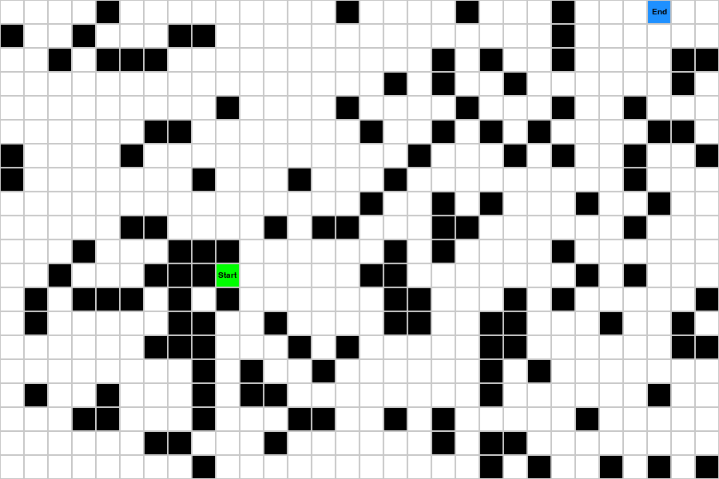

Throught it would be nice to visualize some pathfinding algorithms and study how they work, so I made this.

To run the simulation run:
```
python3 simulation.py
```

This will run both baseline solvers, first the random, then the circular one. You need to close the app to move on the next.

## Baseline models
The simulation will sometimes produce onsolveable simulations.

- BaselineSolvers: Both a random and a circular solver. CircleBaselineSolver is basically the theory behind [Dijkstra’s algorithm](https://www.graphable.ai/blog/pathfinding-algorithms/), but since there is no difference in the length between nodes, this becomes a simple circular solver
- Heuristic Solver: Chooses the node with the shortest distance to the target node.

Random Solver: | Circular Solver: | Heuristic Solver
:-------------:|:---------------:|:----------:
Finished in 384 moves | Finished in 450 moves | Finished in 222 moves
 |  | 

## Algorithms:
- [A*](https://www.geeksforgeeks.org/a-search-algorithm/): Dependent on knowing the end point to work. Large improvement over BaselineSolvers

## Notes for the future
- Maybe train some deep RL on this?
- Could be fun to add fog to the agent and visualize with fog?
- Maybe make some red stations, which are the only places the AI can choose to go, although the aim should still be to travel the least amount of tiles overall.
- Maybe make some forests, lakes that takes longer to get through?
- I also need to make the actual route and showcase it